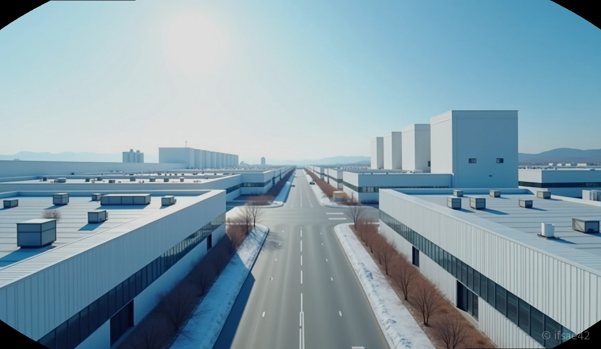
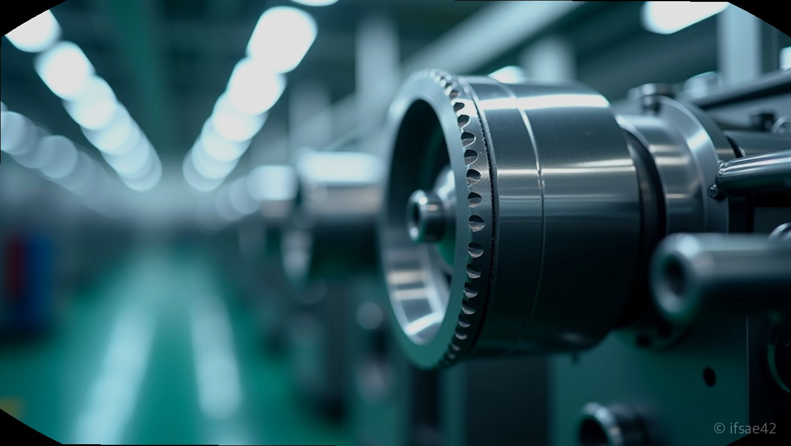

> 자동 생성 초안 · 2026-07-10

# 제천 신규 사업체 분석: 클레이에스제천 기업 정보 및 주요 사업 영역 정리

제천 지역의 산업 지도가 조금씩 변화하고 있습니다. 최근 공공 데이터를 통해 확인되는 신규 사업체 등록 현황을 살펴보면, 기존의 서비스 및 유통업 위주에서 벗어나 점차 전문성을 갖춘 제조업 기반의 기업들이 지역 경제의 새로운 동력으로 떠오르는 모습을 볼 수 있습니다. 그중에서도 많은 이들의 호기심을 자극하는 곳이 바로 '클레이에스제천'입니다.

새로운 기업이 지역에 둥지를 튼다는 것은 단순한 사업장 하나가 늘어나는 것 이상의 의미를 가집니다. 지역 내 고용 창출은 물론, 관련 산업 생태계가 활성화되는 신호탄이 되기도 하기 때문입니다. 오늘은 이 기업이 어떤 정체성을 가지고 있는지, 그리고 제천의 산업 환경과 어떻게 맞닿아 있는지 분석해 보았습니다.

## 클레이에스제천 사업 개요

클레이에스제천은 최근 신규 사업체 명단에 이름을 올리며 지역 사회의 주목을 받고 있는 기업입니다. 기업명에서 유추할 수 있듯이 특정 소재나 화학, 혹은 기술 집약적인 분야를 다룰 가능성이 높습니다.

현재까지 공개된 신규 사업자 등록 정보를 종합해 보면, 이 기업은 제천 지역 내에서 안정적인 생산 기반을 마련하고 초기 비즈니스 모델을 구축하는 단계에 있습니다. 대개 이러한 신규 제조업체들은 다음의 핵심 영역에 집중하는 경향을 보입니다.

*   **전문 제조 공정:** 지역 내 원자재 수급 및 특화된 생산 라인 구축
*   **기술 고도화:** 산업용 소재 혹은 관련 부품의 기술적 완성도 확보
*   **공급망 관리:** 지역 내외 네트워크를 활용한 효율적인 유통 및 물류 시스템

해당 기업의 구체적인 품목이나 세부 공정은 기업 경영 전략에 따라 변동될 수 있으므로, 정확한 사업 분야는 기업의 공식적인 사업자 등록 업종 코드와 향후 발표되는 구인 정보 등을 통해 지속적인 확인이 필요합니다.

## 제천 산업의 새로운 흐름

제천은 지리적으로 내륙 물류의 요충지이자, 최근 여러 산업 단지들이 정비되면서 제조업 진입 장벽이 낮아지고 있는 도시입니다. 클레이에스제천과 같은 신규 사업체들이 연이어 등장하는 배경에는 이러한 인프라 개선이 큰 역할을 했습니다.

제조업체의 신규 등록은 지역 경제에 다음과 같은 긍정적인 파급력을 가져옵니다.

1.  **일자리 다변화:** 서비스업 중심의 고용 시장에서 기술직 및 생산직 등 양질의 일자리가 창출됩니다.
2.  **연관 산업 활성화:** 원자재 공급, 포장, 물류, 시설 유지보수 등 관련 중소업체들의 동반 성장이 가능해집니다.
3.  **지역 세수 증대:** 사업장의 안정적인 정착을 통해 지방세 수입이 늘고, 이는 다시 지역 인프라 재투자로 이어지는 선순환 구조를 만듭니다.

특히 제천 내 기존 산업 단지에 입주하는 기업들은 이미 확보된 전기, 수도, 도로망 등의 인프라를 즉각적으로 활용할 수 있다는 강점이 있습니다. 이는 초기 사업 비용을 절감하고자 하는 신규 기업들에게 매력적인 요소로 작용하며, 클레이에스제천 역시 이러한 지리적·환경적 이점을 충분히 고려했을 것으로 보입니다.

## 협업 및 비즈니스 포인트

새롭게 시작하는 기업과 비즈니스 협업을 고려하거나 취업 정보를 찾는다면 몇 가지 실전 팁을 활용해 보시기 바랍니다.

우선, 기업의 규모와 성격에 맞춘 접근이 필요합니다. 신규 사업체의 경우 초기에는 시스템 정착에 집중하기 때문에, 해당 기업이 속한 산업군 내의 관련 조합이나 제천 상공회의소 등의 자료를 통해 기업의 발전 방향을 모니터링하는 것이 좋습니다.

또한, 채용 정보를 확인할 때는 단순히 구인 공고만 볼 것이 아니라, 해당 기업이 요구하는 '핵심 기술 역량'이 무엇인지 파악해야 합니다. 제조업 특성상 현장 관리자나 생산 기술직에 대한 수요가 높을 가능성이 크므로, 관련 자격증이나 경력을 미리 점검하는 전략이 필요합니다.

제천은 현재 신규 제조업체들에게 매우 우호적인 환경을 조성하고 있습니다. 클레이에스제천이 지역 산업 생태계에 성공적으로 안착하여, 지역민과 함께 동반 성장하는 기업으로 자리매김하기를 기대합니다. 신규 사업체 정보는 시간이 지남에 따라 업데이트되므로, 정기적인 공공 데이터 확인을 통해 최신 현황을 추적해 보시길 권장합니다.

#제천기업 #클레이에스제천 #제천신규사업체 #제천산업단지 #지역경제활성화
