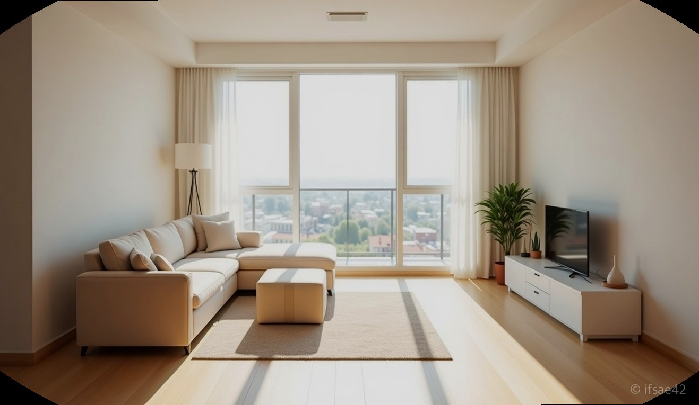
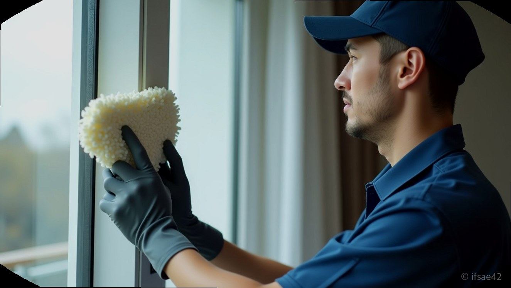
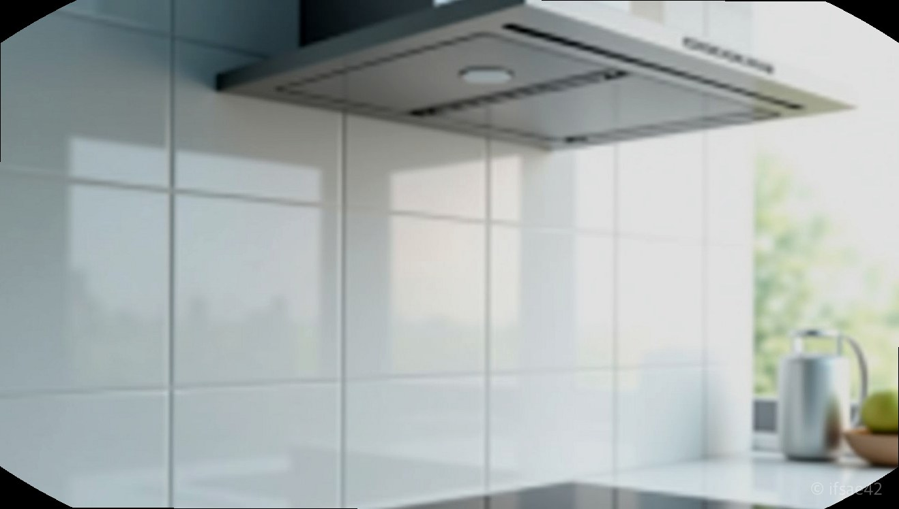

> 자동 생성 초안 · 2026-07-14

# 입주청소 고민 끝! 클린어벤저스 내돈내산 솔직 후기와 업체 선정 꿀팁

새로운 보금자리로 이사하는 설렘도 잠시, 막상 텅 빈 집을 마주하면 어디서부터 손을 대야 할지 막막해지기 마련입니다. 특히 신축 아파트의 미세한 공사 분진이나 구축의 묵은 때는 일반적인 청소만으로는 완벽하게 제거하기 어렵죠. 저 역시 이번 이사를 앞두고 수많은 업체 사이에서 고민하다가, 결국 입소문과 유튜브로 검증된 ‘클린어벤저스’를 선택했습니다. 결론부터 말씀드리면, 왜 다들 이곳을 찾는지 확실히 알 수 있었습니다.

## 44만 유튜버의 전문성

많은 분이 청소 업체를 고를 때 가장 걱정하는 부분이 바로 '신뢰도'입니다. 일회성으로 끝나는 작업인 만큼, 대충 하고 사라지는 업체는 아닐지 불안하기 때문이죠. 제가 클린어벤저스를 선택한 결정적인 이유는 바로 44만 구독자를 보유한 유튜브 채널의 영향력이었습니다. 단순히 홍보만 하는 것이 아니라, 청소 과정을 투명하게 공개하고 전문적인 노하우를 공유하는 모습이 큰 신뢰로 다가왔습니다.

이곳은 일반적인 인력 사무소와 달리, 체계적인 교육을 이수한 전문가들이 직접 현장에 투입됩니다. 송파, 강서, 광진 등 서울 전역은 물론 경기 지역까지 폭넓게 커버하며, 이미 검증된 프로세스를 통해 서비스를 제공합니다. 유튜브를 통해 봐왔던 그 꼼꼼한 손길을 제 집에서 직접 경험하니, 업체 선정을 위해 쏟았던 수많은 검색 시간이 아깝지 않다는 생각이 들었습니다.

## 청소 전후 드라마틱 변화

청소 당일, 팀원들이 도착해 장비를 세팅하는 모습부터 예사롭지 않았습니다. 가장 눈에 띄었던 것은 바로 전문 장비와 약품입니다. 단순히 세정제만 뿌리고 닦아내는 것이 아니라, 공간의 특성과 오염 상태에 맞는 친환경 약품을 구분해서 사용하더군요. 가족이 거주할 공간인 만큼 독한 화학 약품에 대한 걱정이 컸는데, 안전성을 고려한 제품을 사용한다는 점이 무척 안심되었습니다.

비포&애프터는 실로 놀라웠습니다. 특히 주방 후드 기름때와 창틀에 찌든 먼지는 제 힘으로는 도저히 해결이 불가능해 보였는데, 전용 장비로 케어하니 마치 새것처럼 변했습니다. 화장실 타일 사이의 물때와 배수구 깊숙한 곳까지 완벽하게 살균 소독된 것을 보니, 비싼 비용을 지불하고 전문 업체를 부르는 이유를 몸소 체감할 수 있었습니다. 구석구석 손이 닿지 않는 부분까지 체크해주시는 팀장님의 디테일에 감동받을 정도였죠.

## 실패 없는 예약 팁

성공적인 입주청소를 위해 업체 선정 시 꼭 확인해야 할 체크리스트를 정리해 드립니다.

*   **상담 과정의 투명성:** 예약 시 추가 요금 발생 여부나 청소 범위를 명확히 고지하는지 확인하세요.
*   **전문 장비 보유:** 가정용 청소기가 아닌, 산업용 고성능 장비와 전문 약품을 사용하는지 체크해야 합니다.
*   **AS 정책:** 청소 완료 후 미흡한 부분이 발견되었을 때 사후 처리가 가능한지 확인하는 것이 중요합니다.
*   **후기 확인:** 공식 홈페이지나 커뮤니티의 최신 후기를 통해 실제 작업 퀄리티를 미리 파악하세요.

클린어벤저스는 카카오톡 채널을 통해 상담부터 예약까지 간편하게 진행할 수 있습니다. 인기 있는 업체인 만큼 이사 날짜가 정해졌다면 최소 3~4주 전에는 미리 스케줄을 확인하는 것이 좋습니다. 특히 주말이나 이사 성수기에는 예약이 빠르게 마감되니, 고민은 예약만 늦출 뿐이라는 점을 기억하시길 바랍니다.

이사라는 큰일을 앞두고 청소 때문에 스트레스받고 계신다면, 검증된 전문가에게 맡기고 그 시간에 이사 준비를 더 세심하게 챙겨보시는 건 어떨까요? 깨끗해진 새집에서 시작하는 첫날은 그 무엇과도 바꿀 수 없는 기분 좋은 선물이 될 것입니다. 여러분의 새로운 출발을 응원합니다.

#클린어벤저스 #입주청소 #이사청소후기
