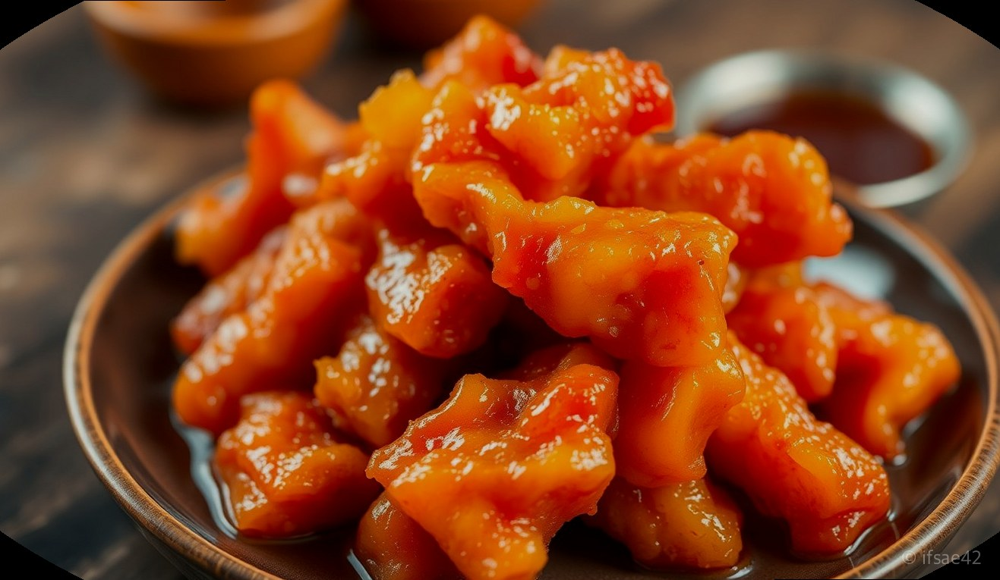
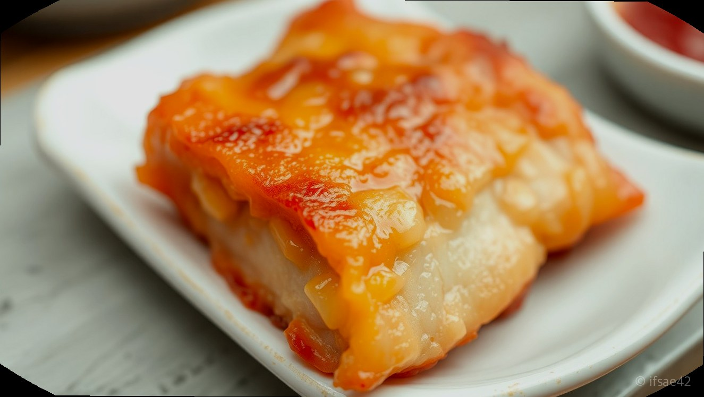
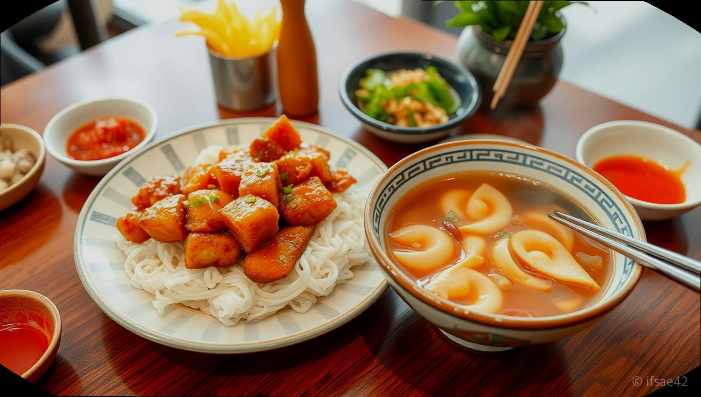
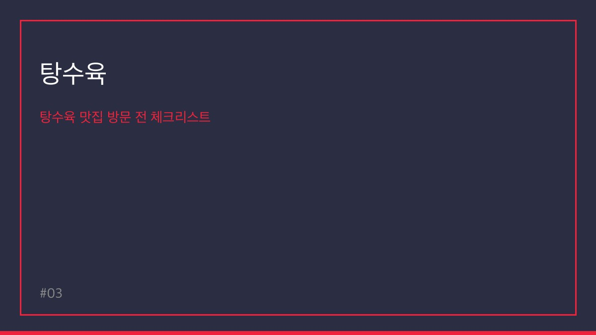
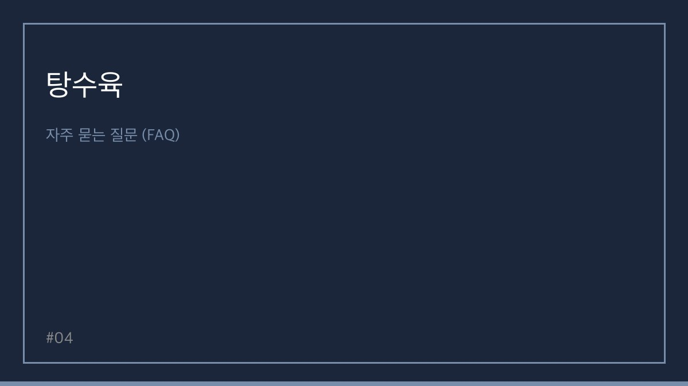
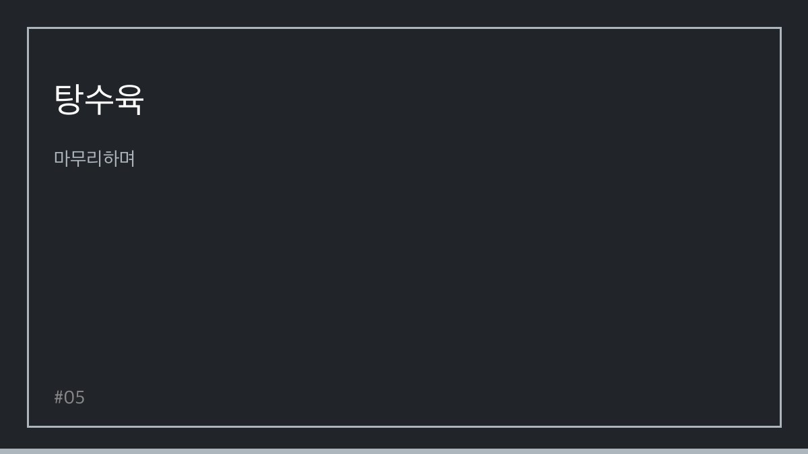

> 자동 생성 초안 · 2026-05-27

# [강화도] 탕수육 맛집 추천: 순무탕수육 꼭 드세요! (내돈내산 후기)

안녕하세요! 맛있는 중국 요리를 사랑하는 여러분, 오늘은 특별한 탕수육 맛집을 소개해 드리려고 합니다. 바로 강화도에 위치한 '금문도'인데요. 신선한 재료와 독창적인 메뉴로 많은 분들의 사랑을 받고 있는 이곳에서, 특히 강화순무를 활용한 '순무탕수육'은 한 번 맛보면 잊을 수 없는 특별한 경험을 선사합니다. 내돈내산으로 직접 방문하여 맛본 생생한 후기를 지금부터 들려드리겠습니다.

강화도 하면 떠오르는 아름다운 자연과 함께 맛있는 먹거리를 빼놓을 수 없습니다. 그중에서도 금문도는 강화순무의 신선하고 건강한 풍미를 담은 특별한 탕수육으로 유명세를 떨치고 있습니다. 겉은 바삭하고 속은 촉촉한 탕수육의 매력을 제대로 느낄 수 있으며, 평범한 탕수육과는 차원이 다른 맛을 자랑합니다. 예약 없이는 방문하기 어려울 정도로 인기가 많으니, 방문 계획이 있으시다면 미리 예약하시는 것을 추천합니다.

이번 글에서는 금문도의 순무탕수육을 중심으로, 함께 즐기기 좋은 메뉴와 방문 팁까지 상세하게 알려드릴 예정입니다. 강화도로 나들이를 계획하고 계시거나, 특별한 탕수육 맛집을 찾고 계신다면 이 글이 큰 도움이 될 것입니다. 그럼, 지금 바로 강화도 금문도로 떠나볼까요?

## 강화도 금문도: 순무탕수육의 특별함

금문도는 강화도에서 꼭 가봐야 할 맛집으로 손꼽히는 곳입니다. 이곳의 가장 큰 특징은 바로 '순무탕수육'입니다. 신선한 강화순무를 탕수육에 접목시킨다는 아이디어 자체가 매우 독창적이며, 그 맛 또한 기대 이상입니다. 갓 튀겨져 나온 탕수육은 황금빛으로 먹음직스럽게 빛나고, 곁들여 나오는 소스는 새콤달콤하면서도 은은한 순무의 풍미가 더해져 독특한 매력을 발산합니다.

순무탕수육의 튀김옷은 얇고 바삭하여 씹을 때마다 경쾌한 소리가 납니다. 속살은 부드러운 돼지고기가 육즙을 가득 머금고 있어 씹을수록 고소한 맛이 일품입니다. 일반적인 탕수육과는 달리, 순무의 아삭한 식감과 깔끔한 맛이 더해져 느끼함 없이 계속해서 손이 가는 매력이 있습니다. 튀김옷과 고기의 조화, 그리고 순무의 신선함이 어우러져 전에 없던 새로운 탕수육의 세계를 열어줍니다.

가격은 25,000원으로, 2~3명이서 충분히 즐길 수 있는 양입니다. 탕수육 외에도 강화백짬뽕(13,000원) 등 다른 메뉴들도 맛있다고 정평이 나 있지만, 금문도에 방문하신다면 순무탕수육은 절대 놓치지 마시길 바랍니다. 4~5명이 방문하면 다양한 메뉴를 맛볼 수 있다는 점도 참고하시면 좋습니다.

## 탕수육과 함께 즐기기 좋은 메뉴 조합

금문도에서는 순무탕수육 외에도 다양한 중식 메뉴를 맛볼 수 있습니다. 여러 명이 방문했을 때, 탕수육과 함께 주문하면 더욱 풍성한 식사를 즐길 수 있는 메뉴들을 추천해 드립니다.

### 강화백짬뽕

금문도의 또 다른 인기 메뉴인 강화백짬뽕은 맑고 시원한 국물이 일품입니다. 일반적인 짬뽕과는 달리, 맵지 않으면서도 깊은 해산물의 풍미를 느낄 수 있어 누구나 부담 없이 즐길 수 있습니다. 순무탕수육의 달콤함과 짭짤함 사이에서 입안을 개운하게 정리해주는 역할을 톡톡히 합니다. 푸짐한 해산물과 채소가 듬뿍 들어가 있어 든든한 한 끼 식사로도 손색이 없습니다.

### 춘권

바삭한 춘권은 남녀노소 누구나 좋아하는 메뉴입니다. 금문도의 춘권은 속이 꽉 차 있고 겉은 바삭하게 튀겨져 나와 탕수육과는 또 다른 매력의 바삭함을 선사합니다. 춘권 안에 들어있는 고기와 채소의 조화가 좋으며, 함께 제공되는 소스에 찍어 먹으면 더욱 맛있습니다. 탕수육을 메인으로 하되, 곁들임 메뉴로 춘권을 추가하면 더욱 다채로운 식감을 즐길 수 있습니다.

### 깐풍기

매콤달콤한 맛을 좋아하신다면 깐풍기를 추천합니다. 쫄깃한 닭고기를 매콤한 소스와 함께 볶아낸 깐풍기는 밥반찬으로도, 술안주로도 훌륭합니다. 탕수육의 달콤함과는 또 다른 매력의 매콤함이 식욕을 돋우고, 혀를 자극하여 계속해서 젓가락이 가게 만듭니다. 금문도의 깐풍기는 맵기 조절도 가능하다고 하니, 취향에 맞게 주문하시면 더욱 만족스러운 식사를 하실 수 있을 것입니다.

## 탕수육 맛집 방문 전 체크리스트

맛있는 탕수육을 제대로 즐기기 위해 방문 전에 꼭 확인해야 할 사항들을 정리해 보았습니다.

*   **영업시간 및 휴무일 확인:** 금문도는 월요일 휴무이며, 화요일은 영업시간이 짧으니 방문 전 반드시 확인하세요. (월요일 10:30 - 15:00, 화요일 휴무, 수~금 10:00 - 19:30, 브레이크 타임 15:00 - 16:30)
*   **예약 필수:** 인기가 매우 많은 곳이므로, 특히 주말이나 공휴일에는 미리 예약하시는 것이 좋습니다.
*   **주차 정보 확인:** 강화도 내 식당들은 주차 공간이 협소한 경우가 많으니, 대중교통 이용 또는 인근 공영 주차장 정보를 미리 확인하는 것이 좋습니다.
*   **메뉴 선택:** 순무탕수육은 필수! 함께 곁들일 메뉴로 강화백짬뽕, 춘권, 깐풍기 등을 고려해보세요.
*   **방문 인원:** 2~3명이라면 탕수육과 1~2가지 메뉴, 4~5명이라면 더욱 다양한 메뉴를 맛볼 수 있습니다.

## 자주 묻는 질문 (FAQ)

**Q1. 금문도의 순무탕수육은 어떤 맛인가요?**
A1. 겉은 바삭하고 속은 촉촉한 탕수육에 강화순무의 신선하고 깔끔한 풍미가 더해져 독특하면서도 매력적인 맛을 자랑합니다. 느끼함 없이 계속해서 먹게 되는 맛입니다.

**Q2. 예약은 어떻게 하나요?**
A2. 전화 또는 방문을 통해 예약이 가능합니다. 인기 있는 시간대는 빠르게 마감될 수 있으니 미리 연락하시는 것이 좋습니다.

**Q3. 탕수육 외에 추천 메뉴가 있나요?**
A3. 강화백짬뽕, 춘권, 깐풍기 등도 많은 분들이 찾는 인기 메뉴입니다. 취향에 따라 탕수육과 함께 주문하시면 더욱 풍성한 식사를 즐기실 수 있습니다.

**Q4. 주차는 가능한가요?**
A4. 식당 자체 주차 공간이 협소할 수 있으므로, 방문 전 주차 정보를 확인하시거나 대중교통 이용을 고려하시는 것이 좋습니다.

## 마무리하며

오늘은 강화도에 위치한 특별한 탕수육 맛집, 금문도를 소개해 드렸습니다. 신선한 강화순무를 활용한 독창적인 순무탕수육은 분명 여러분에게 잊지 못할 미식 경험을 선사할 것입니다. 맛있는 탕수육과 함께 강화도의 아름다운 풍경을 즐기며 즐거운 시간을 보내시길 바랍니다.

혹시 여러분이 알고 계신 다른 특별한 탕수육 맛집이 있다면 댓글로 공유해주세요!

#강화도맛집 #탕수육맛집 #순무탕수육

