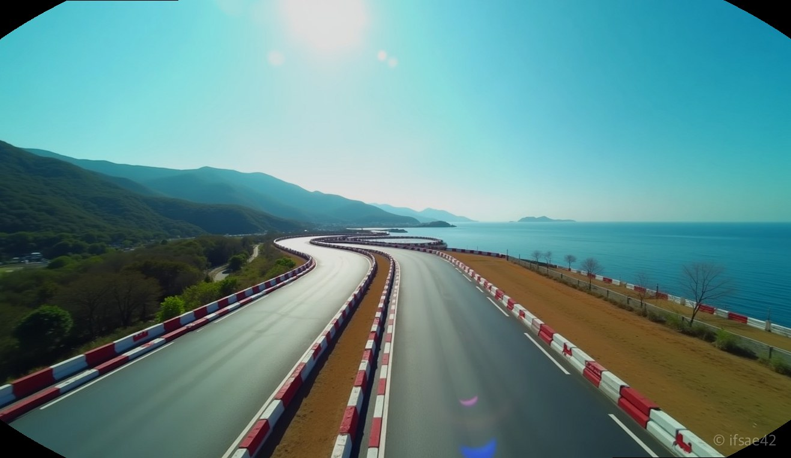
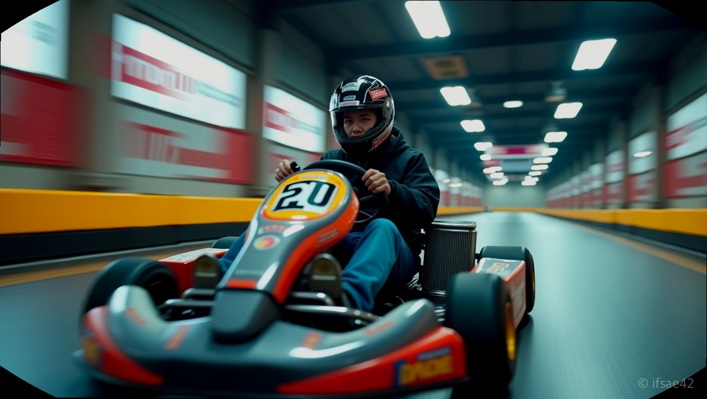

> 자동 생성 초안 · 2026-07-14

# 통영 놀거리 추천, 현실판 카트라이더 더카트인통영 할인 및 솔직 탑승 후기

통영 여행을 계획할 때 루지만 떠올리셨나요? 통영의 아름다운 바다를 구경하는 것도 좋지만, 여행의 활력을 불어넣어 줄 특별한 액티비티가 필요하다면 이곳을 주목해 보세요. 게임 속에서만 보던 레이싱을 현실에서 즐길 수 있는 곳, 바로 '더카트인통영'입니다. 오늘은 제가 직접 다녀온 생생한 후기와 함께 알뜰하게 이용하는 꿀팁까지 모두 정리해 드립니다.

## 현실판 카트라이더의 매력
더카트인통영은 단순히 카트를 타는 공간을 넘어선 테마파크입니다. 이곳의 가장 큰 장점은 바로 '날씨 제약이 없다'는 점입니다. 실내와 실외 서킷을 모두 갖추고 있어 비가 오거나 바람이 부는 궂은 날씨에도 여행 계획을 수정할 필요가 없습니다.

특히 어린 자녀를 동반한 가족 단위 여행객이나 이색 데이트를 즐기고 싶은 커플들에게 최적의 장소입니다. 카트는 주니어용과 성인용이 구분되어 있고, 안전 교육을 철저히 진행한 후 탑승하기 때문에 초보자도 안심하고 즐길 수 있습니다. 실제 트랙에 올라서면 엔진의 진동과 코너를 돌 때의 짜릿한 속도감이 느껴져 마치 게임 속 주인공이 된 듯한 기분을 만끽하게 됩니다.

## 가격 할인과 예약 팁
입장료가 다소 부담스럽다면 다양한 온라인 예매 플랫폼을 활용해 보세요. 네이버 예약이나 소셜 커머스 사이트에서 상시 할인 티켓을 판매하고 있습니다. 현장에서 그냥 결제하는 것보다 최소 5~10% 이상 저렴하게 이용할 수 있으니 방문 전 미리 예매하는 것은 필수입니다.

또한, 통영 지역 주민이거나 특정 제휴 카드를 소지하고 있다면 추가 할인을 받을 수 있는 경우도 있으니 방문 전 공식 홈페이지를 꼭 확인하시길 바랍니다. 주차는 시설 내에 넓고 쾌적한 전용 주차장이 마련되어 있어 초보 운전자도 주차 걱정 없이 방문하기 좋습니다.

## 안전하고 즐거운 레이싱
처음 탑승하시는 분들은 혹시 사고가 나지 않을까 걱정하실 수도 있습니다. 하지만 더카트인통영은 카트 주변에 충격 흡수 범퍼가 둘러져 있고, 코너마다 안전요원이 배치되어 있어 돌발 상황에 빠르게 대처합니다. 헬멧 착용은 필수이며, 긴 머리는 묶고 슬리퍼보다는 운동화를 착용하는 것이 훨씬 안정적인 운전을 돕습니다.

처음 몇 바퀴는 코스에 익숙해지는 연습 시간으로 생각하고 천천히 도는 것을 추천합니다. 서킷의 곡선 구간을 매끄럽게 통과하는 요령을 터득하면 마지막 바퀴에는 훨씬 더 신나는 속도감을 즐길 수 있습니다.

## 알찬 통영 여행 코스 더카트인통영에서 레이싱을 즐긴 후에는 근처의 통영 관광지를 묶어 코스를 짜보세요.

1. 오전: 더카트인통영에서 신나는 카트 레이싱 체험
2. 점심: 통영 도산면 인근의 신선한 해산물 식당 방문
3. 오후: 통영 케이블카나 루지로 이동하여 통영의 전경 감상
4. 저녁: 통영 중앙전통시장에서 꿀빵과 충무김밥으로 마무리

이러한 코스로 움직이면 알찬 하루를 보낼 수 있습니다. 활동적인 레이싱과 정적인 관광지를 적절히 섞는 것이 통영 여행의 만족도를 높이는 핵심입니다.

## 자주 묻는 질문
**Q1. 비가 오면 카트 운영이 중단되나요?**
A1. 실내 서킷이 완비되어 있어 비가 오는 날에도 정상적으로 이용 가능합니다.

**Q2. 초보자도 바로 운전할 수 있을 정도로 쉬운가요?**
A2. 조작법이 매우 간단하며 출발 전 안전 교육을 충분히 해주므로 누구나 쉽게 즐길 수 있습니다.

통영카트라이더를 찾는 분들에게 더카트인통영은 후회 없는 선택이 될 것입니다. 시원한 바람을 가르며 달리는 쾌감을 이번 여행에서 꼭 경험해 보시길 바랍니다.

#통영여행 #더카트인통영 #통영카트라이더
