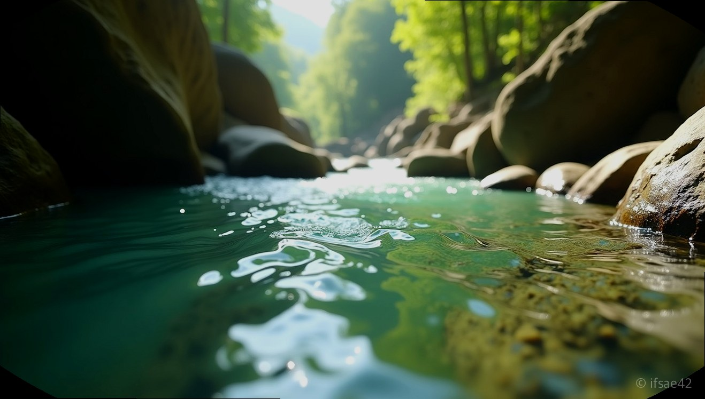

> 자동 생성 초안 · 2026-07-14

# 포항 하옥계곡 물놀이 총정리: 주차부터 취사 가능 스팟, 선녀탕 포인트 가는 법까지

한여름 무더위가 기승을 부릴 때면 가장 먼저 생각나는 곳이 있습니다. 바로 발만 담가도 등골이 오싹해질 만큼 시원한 계곡물이죠. 경북 포항시 죽장면에 위치한 **포항하옥계곡**은 맑은 물과 울창한 숲이 어우러져 매년 여름 많은 여행객이 찾는 명소입니다. 다만 포항 시내에서도 꽤 깊숙이 들어가야 하는 오지인 만큼, 떠나기 전 꼼꼼한 정보 파악이 필수입니다.

## 가는 길과 주차 노하우

포항하옥계곡은 접근성이 그리 좋지 않습니다. 포항 중심부에서 출발해도 1시간 이상 구불구불한 산길을 달려야 도착할 수 있습니다. 그래서 네비게이션 설정이 매우 중요한데요. 단순히 '하옥계곡'이라고만 검색하면 너무 넓은 범위를 안내할 수 있으니, 목적지를 설정할 때 '하옥계곡 주차장' 혹은 '하옥리 보건진료소' 인근을 검색하시는 것이 정확합니다.

주말이나 성수기에는 오전 9시 이전에 도착하는 것을 권장합니다. 계곡 입구 근처에 공영 주차장과 노지 주차 공간이 마련되어 있지만, 방문객이 몰리는 시간에는 금세 만차가 되기 때문입니다. 특히 하옥계곡은 영덕 옥계계곡과도 이어져 있어, 지리적으로 영덕과 포항의 경계에 위치한 만큼 이동 동선을 미리 파악하면 훨씬 쾌적한 여행이 가능합니다.

## 명당 찾기와 선녀탕 정보

하옥계곡의 매력은 수심이 다양하다는 점입니다. 아이들이 물놀이하기 좋은 얕은 곳부터 어른들도 수영을 즐길 수 있는 깊은 소까지 구간별로 특색이 뚜렷합니다. 그중에서도 많은 분이 찾는 곳은 바로 ‘선녀탕’ 포인트입니다. 물빛이 비취색으로 빛날 만큼 투명하고 아름다워 ‘선녀가 내려와 목욕을 했다’는 전설이 붙었을 정도죠.

선녀탕 포인트로 가려면 상류 쪽으로 올라가야 하는데, 길목이 좁고 험할 수 있으니 안전에 주의해야 합니다. 보통 하옥계곡의 주요 스팟들은 마을 입구에서 계곡을 따라 길게 이어져 있습니다. 텐트를 치거나 당일치기 그늘막을 설치할 수 있는 평평한 자리가 있는 곳이 인기가 많으니, 조금 일찍 움직여 물 흐름이 완만하고 바닥이 큰 자갈로 된 곳을 선점하시기 바랍니다.

## 취사와 필수 체크리스트

많은 분이 궁금해하시는 것이 바로 취사 가능 여부입니다. 하옥계곡은 특정 구역 내에서 조리가 허용되지만, 반드시 지정된 장소를 이용하고 쓰레기를 완벽하게 되가져가는 것이 원칙입니다. 자연을 보호하기 위해 취사 시 발생하는 음식물 쓰레기와 일반 쓰레기는 반드시 분리하여 지정된 수거함에 버리거나 직접 회수해야 합니다.

성공적인 당일치기를 위한 체크리스트를 정리해 드립니다.

*   **준비물:** 물놀이 신발(아쿠아슈즈 필수), 개인 돗자리 또는 캠핑 의자, 구명조끼, 여벌 옷, 수건
*   **먹거리:** 조리가 간편한 음식, 충분한 식수, 쓰레기를 담을 대용량 봉투
*   **안전:** 계곡은 수심 변화가 급격할 수 있으므로 구명조끼 착용 권장, 기상 악화 시 즉시 퇴거
*   **기타:** 애견 동반 시 목줄 착용 필수, 주변 환경 오염 금지

하옥계곡 인근에는 민박집과 소규모 펜션, 캠핑장도 운영되고 있습니다. 당일치기가 아닌 1박 2일 일정을 계획 중이라면 사전에 전화로 예약 가능 여부를 확인해 보세요. 특히 성수기에는 예약이 빨리 마감되니 최소 2주 전에는 알아보는 것이 좋습니다.

도심의 소음을 벗어나 맑은 물소리와 함께하는 여름 휴가를 찾으신다면 포항하옥계곡만 한 곳이 없습니다. 가는 길이 조금 멀게 느껴질지라도 막상 눈앞에 펼쳐진 맑은 계곡물을 마주하면 그 고생이 싹 잊힐 것입니다. 올여름, 안전하고 깨끗하게 자연을 즐기는 에티켓을 지키며 시원한 추억 만드시길 바랍니다.

#포항하옥계곡 #경북계곡여행 #포항물놀이명소
