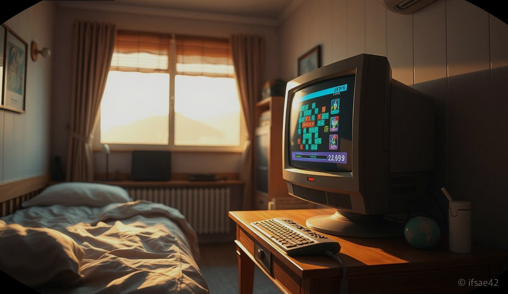
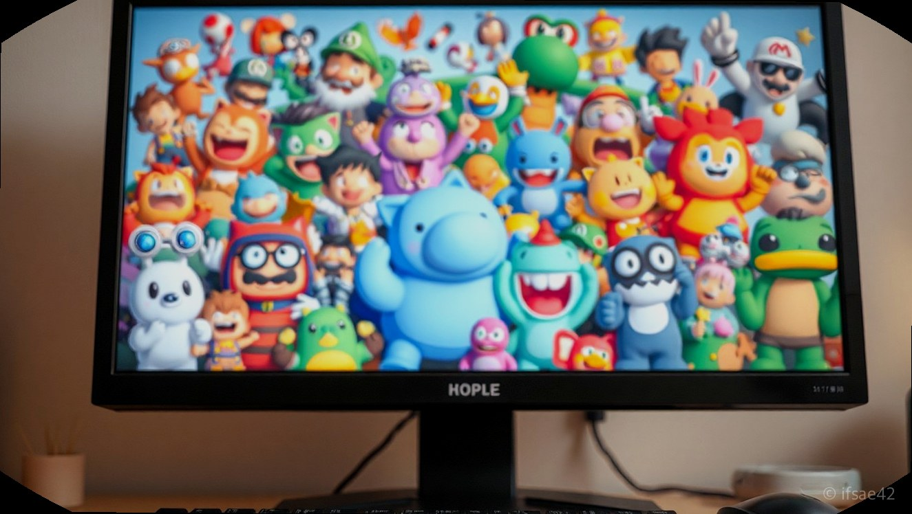
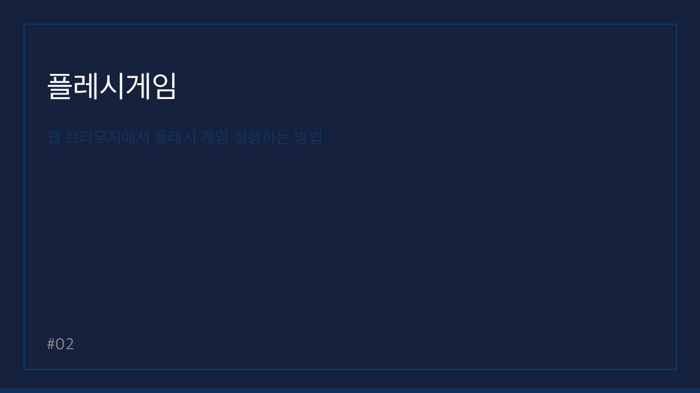

> 자동 생성 초안 · 2026-06-09

# 추억의 플래시게임 바로가기 및 실행 방법 총정리 (슈게임, 이누야샤)

90년대생과 2000년대 초반 학창 시절을 보낸 분들이라면, 학교 컴퓨터실이나 방과 후 집에서 즐겼던 플레시게임에 대한 향수를 한 번쯤 느껴보셨을 것입니다. 당시에는 별도의 설치 과정 없이 웹 브라우저만 열면 간단하게 즐길 수 있었던 게임들이었지만, 2020년 말 어도비 플래시 서비스가 공식적으로 종료되면서 많은 분이 아쉬움을 표하셨습니다.

하지만 기술의 발전과 추억을 지키려는 노력 덕분에, 오늘날에도 여전히 그 시절의 감성을 그대로 느낄 수 있는 방법들이 존재합니다. 오늘은 플레시게임의 대명사 격인 슈게임부터 이누야샤 시리즈까지, 다시 한번 즐길 수 있는 실행 방법과 추천 사이트를 상세히 정리해 드립니다.

## 추억의 플레시게임 인기 순위 및 추천작

플레시게임의 전성기 시절, 우리를 울고 웃게 했던 게임들은 지금 봐도 그 게임성만큼은 매우 뛰어납니다. 특히 단순한 조작법 속에 높은 몰입감을 주는 게임들이 많았는데, 그중에서도 가장 인기 있었던 작품들을 꼽아보았습니다.

가장 먼저 언급할 게임은 역시 '슈게임' 시리즈입니다. 슈의 라면가게, 슈의 미용실 등은 당시 여학생들 사이에서 엄청난 인기를 끌었으며, 제한 시간 내에 정해진 미션을 완수해야 하는 긴장감이 핵심이었습니다. 다음으로는 '이누야샤 데몬 토너먼트'를 빼놓을 수 없습니다. 애니메이션의 인기를 등에 업고 화려한 스킬과 타격감으로 남학생들의 마음을 사로잡았던 격투 게임입니다. 또한, '순간이동 탈출 게임'이나 '고군분투' 같은 작품들은 지금 플레이해도 손색없는 두뇌 회전과 컨트롤의 재미를 선사합니다.

## 웹 브라우저에서 플래시 게임 실행하는 방법

과거에는 웹 브라우저가 플래시 파일을 직접 읽어 들였지만, 현재는 보안상의 이유로 지원이 중단되었습니다. 이를 해결하기 위해 등장한 것이 바로 '러플(Ruffle)'이라는 에뮬레이터입니다. 러플은 플래시 플레이어를 설치하지 않아도 현대적인 웹 브라우저에서 플래시 파일을 자동으로 변환하여 실행해 주는 오픈소스 소프트웨어입니다.

직접 게임을 실행하는 방법은 크게 세 가지입니다. 첫째, 플래시 게임 전문 아카이브 사이트에 접속하는 것입니다. 사이트 자체에 러플 에뮬레이터가 내장되어 있어 별도의 프로그램 설치 없이 클릭만으로 게임이 구동됩니다. 둘째, '플래시 포인트(Flashpoint)'와 같은 전용 소프트웨어를 PC에 설치하는 방법입니다. 이는 수만 개의 플래시 게임을 오프라인 환경에서도 완벽하게 즐길 수 있도록 데이터베이스화한 프로그램입니다. 셋째, 브라우저 확장 프로그램을 활용하는 것인데, 이는 초보자에게는 다소 복잡할 수 있으므로 앞서 언급한 아카이브 사이트 이용을 가장 권장합니다.

## 플래시 게임 바로가기 및 추천 사이트 안내

현재 가장 활발하게 운영되는 플래시 게임 아카이브 사이트로는 '게임 아카이브(Game Archive)' 계열의 사이트들이나, 국내에서 운영되는 플래시 게임 복원 커뮤니티가 있습니다. 구글 검색창에 '플레시게임 아카이브' 혹은 '슈게임 바로가기'를 검색하시면, 러플이 적용된 사이트들을 쉽게 찾을 수 있습니다.

이러한 사이트들은 대부분 사용자들이 직접 업로드한 게임 데이터를 보존하고 있어, 이누야샤 게임부터 추억의 슈게임 시리즈까지 대부분 검색만으로 바로 플레이가 가능합니다. 사이트에 접속하신 뒤 게임 목록에서 원하는 타이틀을 클릭하면, 화면 중앙에 로딩 바가 나타나며 잠시 후 게임이 시작됩니다. 만약 화면이 나오지 않는다면 페이지를 새로고침하거나 브라우저의 캐시를 삭제한 뒤 다시 시도해 보시기 바랍니다.

## 플래시 게임 실행 체크리스트
- [ ] 구글 크롬 또는 엣지 최신 버전 브라우저를 사용하고 있습니까?
- [ ] 사이트 접속 후 게임 화면이 로딩될 때까지 5~10초 정도 기다리셨습니까?
- [ ] 마우스 클릭이 반응하지 않는다면 '게임 화면 클릭' 버튼을 먼저 눌렀는지 확인했습니까?
- [ ] 소리가 나오지 않는다면 브라우저 탭 상단의 음소거 설정이 해제되어 있는지 확인했습니까?
- [ ] 특정 게임이 실행되지 않을 경우 다른 아카이브 사이트 링크를 시도해 보셨습니까?

## 자주 묻는 질문 (FAQ)

**Q1. 플레시게임을 즐기기 위해 별도의 프로그램을 꼭 설치해야 하나요?**
A1. 아니요, 최근에는 러플 에뮬레이터가 적용된 웹사이트가 많아 브라우저만으로도 충분히 즐길 수 있습니다.

**Q2. 이누야샤 게임이나 슈게임을 다시 하려면 어디로 가야 하나요?**
A2. 구글에 '플레시게임 아카이브'를 검색하여 운영 중인 사이트에 접속한 뒤 검색창에 게임 이름을 입력하시면 됩니다.

**Q3. 모바일에서도 플레시게임을 할 수 있나요?**
A3. 일부 사이트는 모바일 브라우저를 지원하지만, PC 환경에 비해 조작이 어려울 수 있어 가급적 PC 사용을 권장합니다.

오늘 소개해 드린 방법들을 통해 잊고 지냈던 어린 시절의 추억을 다시 한번 경험해 보시길 바랍니다. 단순한 게임을 넘어 그 시절의 향수를 불러일으키는 플레시게임은 언제나 우리에게 즐거운 휴식처가 되어줄 것입니다. 지금 바로 좋아하는 게임을 검색해 보세요.

#플레시게임 #추억의게임 #슈게임
