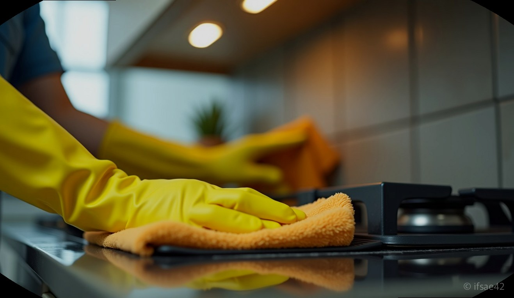
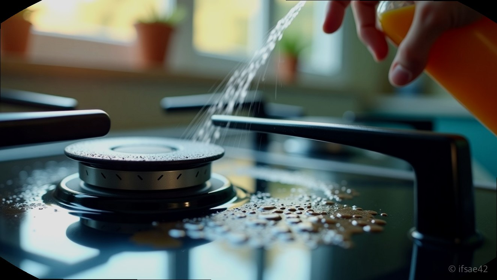
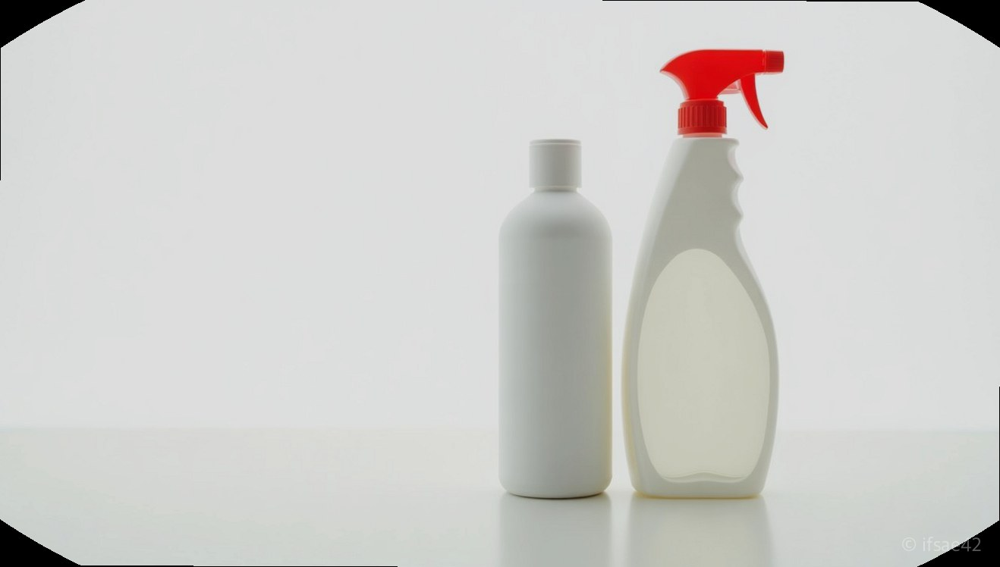

> 자동 생성 초안 · 2026-07-14

# 피비원 사용법과 절대 섞으면 안 되는 세제 주의사항, 기름때 제거 끝판왕

주방 후드에 엉겨 붙은 끈적한 기름때를 볼 때마다 한숨부터 나오신다면, 오늘 소개할 ‘피비원(PB-1)’이 최고의 해결책이 될 것입니다. 피비원은 시중 다목적 세정제 중에서도 독보적인 세정력을 자랑하는 제품으로, 웬만한 찌든때는 뿌리고 닦아내는 것만으로도 말끔히 지워집니다.

하지만 강력한 힘에는 반드시 책임이 따르는 법입니다. 피비원은 강알칼리성 세제이기 때문에 사용 시 각별한 주의가 필요합니다. 특히 **락스와 절대 섞어 쓰면 안 된다**는 점을 강조하며, 안전하고 효율적인 청소 가이드를 정리해 드립니다.

## 강력한 기름때 제거의 비결
피비원이 기름때 제거의 끝판왕으로 불리는 이유는 그 화학적 조성에 있습니다. 기름때는 본래 산성 성분이 많은데, 강알칼리성인 피비원이 이와 만나면 '비누화 반응'을 일으킵니다. 딱딱하게 굳어 있던 기름 성분이 물에 잘 녹는 상태로 분해되는 것입니다.

이 원리 덕분에 가스레인지 주변, 주방 후드 필터, 자동차 엔진룸의 기름때까지 손쉽게 제거할 수 있습니다. 찌든때가 심한 곳에 피비원을 도포하고 3~5분 정도 기다리면, 화학 반응이 충분히 일어나 닦아내기만 해도 묵은 때가 녹아 나옵니다.

## 락스와 섞으면 치명적인 이유
가장 주의해야 할 점은 ‘화학 사고’ 예방입니다. 청소 효율을 높이겠답시고 피비원과 락스를 섞는 분들이 계신데, 이는 매우 위험합니다.

피비원은 강알칼리성 세제이며, 락스는 차아염소산나트륨을 주성분으로 하는 염소계 표백제입니다. 이 두 가지를 혼합하면 화학 반응을 통해 **염소가스**가 발생할 수 있습니다. 염소가스는 인체에 매우 유해하며, 흡입 시 호흡기 손상이나 질식 등 치명적인 결과를 초래할 수 있습니다.

따라서 청소 시에는 반드시 한 가지 세제만 사용하고, 만약 다른 세제를 사용해야 한다면 물로 충분히 헹궈 이전 세제 성분을 완전히 제거한 뒤 진행하시기 바랍니다.

## 안전을 위한 단계별 청소법 피비원의 강력함을 안전하게 누리기 위해서는 다음 단계를 준수해야 합니다.

1. **환기 확보**: 세정제의 분무 입자가 공기 중에 퍼질 수 있으므로, 반드시 창문을 열거나 환풍기를 최대로 가동합니다.
2. **보호구 착용**: 강알칼리성 성분이 피부에 닿으면 단백질을 녹여 피부 자극을 유발합니다. 고무장갑과 마스크를 반드시 착용하세요.
3. **용도 확인**: 모든 표면에 사용 가능한 것은 아닙니다. 특히 알루미늄이나 도장면이 약한 가구는 변색이나 부식이 발생할 수 있으니, 눈에 띄지 않는 구석에 먼저 테스트해 보는 것이 안전합니다.
4. **잔여물 제거**: 오염물을 닦아낸 뒤에는 반드시 깨끗한 물걸레로 여러 번 닦아내어 세제 성분이 남지 않도록 마무리합니다.

## 세제 선택 가이드 청소 효율을 극대화하려면 오염물의 종류에 따라 세제를 다르게 선택해야 합니다.

* **기름때 및 물때**: 피비원(PB-1)을 권장합니다. 기름을 녹이는 데 특화되어 있어 주방과 욕실 바닥 청소에 탁월합니다.
* **곰팡이 및 살균**: 락스를 사용하세요. 곰팡이 뿌리를 제거하고 표백하는 데는 락스만한 제품이 없습니다.

결론적으로, 피비원은 기름때 청소의 강력한 도구이지만, 그만큼 주의가 필요한 화학 제품입니다. 안전 수칙을 철저히 지키며 올바르게 활용한다면, 여러분의 공간을 훨씬 더 쾌적하게 유지할 수 있을 것입니다. 오늘 바로 청소 계획을 세워보시는 건 어떨까요?

#피비원 #기름때제거 #청소꿀팁
