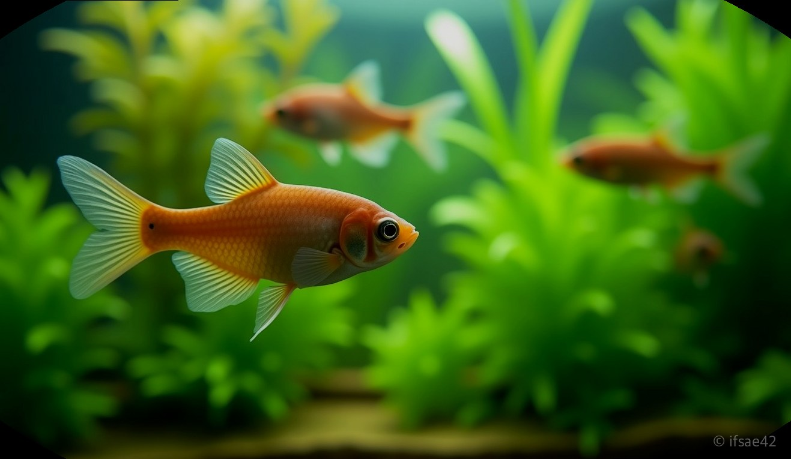
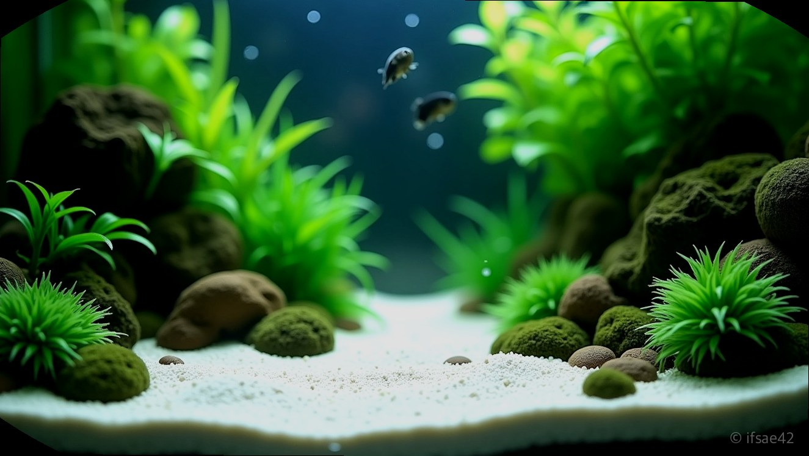

> 자동 생성 초안 · 2026-07-14

# 하스타투스 키우기: 군영의 매력부터 치어 먹이 급여 꿀팁까지 총정리

수많은 코리도라스 중에서도 하스타투스는 단순히 바닥을 훑고 다니는 '청소 물고기'가 아닙니다. 이 작은 생명체의 진정한 가치는 수조 중간 유영층을 가로지르며 펼치는 경이로운 군영에 있습니다. 1~2cm 남짓한 작은 몸집으로 무리 지어 헤엄치는 모습은 어항이라는 작은 세계에 생동감을 불어넣는 최고의 관상 포인트입니다. 성공적인 사육을 위해서는 이들의 습성을 정확히 이해하고, 그에 맞는 환경을 조성해 주는 것이 무엇보다 중요합니다.

## 군영을 위한 최적의 환경 조성

하스타투스의 군영을 매일 감상하고 싶다면 가장 먼저 고려해야 할 것은 '마릿수'입니다. 5마리 미만의 소수만 키우게 되면 겁이 많아져 구석에 숨어 지내는 시간이 길어집니다. 하스타투스는 최소 10마리 이상, 가급적 15~20마리 정도의 군집을 이룰 때 비로소 안정을 느끼며 수조 전체를 활발하게 유영합니다.

어항 세팅 시에는 샌드나 고운 입자의 소일을 바닥재로 선택하는 것이 좋습니다. 이들은 수염이 매우 섬세하기 때문에 날카로운 바닥재는 피해야 합니다. 또한, 수초를 적절히 배치해 주면 심리적 안정감을 느껴 군영 빈도가 훨씬 높아집니다. 수류가 너무 강하면 작은 체구로 버거워할 수 있으니 여과기 출수구 방향을 벽면으로 돌려 잔잔한 환경을 만들어 주시기 바랍니다.

## 성공적인 치어 관리와 먹이법

하스타투스 번식은 코리도라스 중에서도 꽤 매력적인 도전입니다. 치어의 생존율을 높이는 핵심은 '먹이의 크기'와 '급여 횟수'입니다. 부화 직후의 치어는 입이 매우 작기 때문에 일반 사료를 먹지 못합니다. 이때는 브라인 쉬림프를 갓 부화시켜 급여하는 것이 가장 좋습니다. 만약 생먹이가 어렵다면 미세한 가루 형태의 치어 전용 사료를 급여하되, 수질 오염을 방지하기 위해 소량씩 자주 주는 습관을 들여야 합니다.

성어의 경우에도 입이 작다는 점을 항상 기억해야 합니다. 알갱이가 큰 사료는 단번에 삼키기 어려워하므로, 물에 잘 풀어지는 고품질의 소형 어종용 사료나 가루 사료를 선택하세요. 바닥에 가라앉는 타입이라도 하스타투스는 중층에서도 잘 받아먹으니, 사료가 바닥에 쌓여 썩지 않도록 적정량만 급여하는 것이 건강 관리의 핵심입니다.

## 건강한 사육을 위한 합사 가이드

하스타투스는 성격이 매우 온순하여 대부분의 소형 어종과 합사가 가능합니다. 네온 테트라, 라스보라 등 평화로운 성격의 물고기들과는 무리 없이 지내며, 오히려 다른 물고기들과 함께 있을 때 안심하고 유영을 즐기기도 합니다. 다만, 입이 큰 대형 어종이나 영역 다툼이 심한 어종과는 합사를 피해야 합니다. 작은 체구 때문에 자칫하면 먹잇감으로 오해받거나 스트레스로 폐사할 위험이 있기 때문입니다.

수명은 보통 2~3년 정도로, 수질 관리가 잘 된 환경에서는 더 오래 건강하게 지내기도 합니다. 이들은 수질 변화에 민감한 편이므로 환수 시에는 기존 물과 온도를 맞춘 뒤 천천히 투입하는 것을 권장합니다. 주기적인 환수와 안정적인 먹이 급여만 이루어진다면, 여러분의 어항 속에서 매일같이 아름다운 군영을 보여줄 것입니다.

**자주 묻는 질문**

**Q1. 하스타투스를 키울 때 가장 주의할 점은 무엇인가요?**
A1. 너무 적은 마릿수로 키우지 않는 것과 수질 변화에 민감하므로 주기적인 환수를 지키는 것이 가장 중요합니다.

**Q2. 하스타투스 성어에게 일반적인 코리도라스 사료를 줘도 될까요?**
A2. 알갱이가 너무 크면 먹지 못하므로 손으로 으깨어 주거나 입자가 작은 소형 사료로 급여해야 합니다.

**Q3. 어항 청소 물고기로만 쓰기엔 아까운가요?**
A3. 청소 능력보다는 군영을 관찰하는 관상용으로서의 가치가 훨씬 높은 매력적인 어종입니다.

#하스타투스 #코리도라스 #물생활
