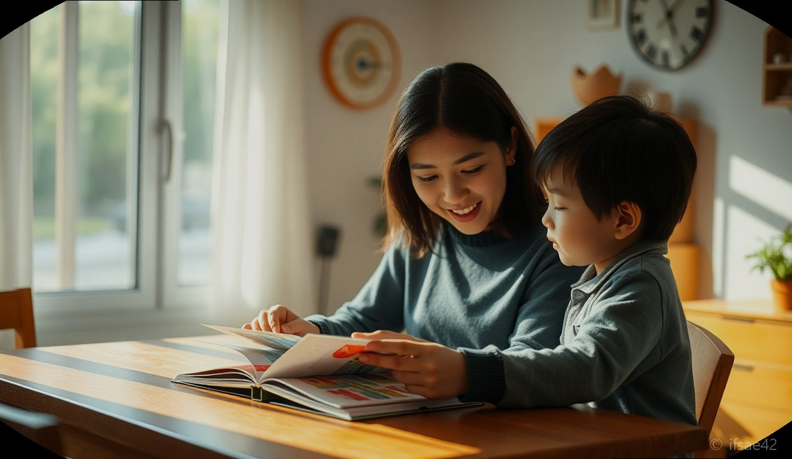
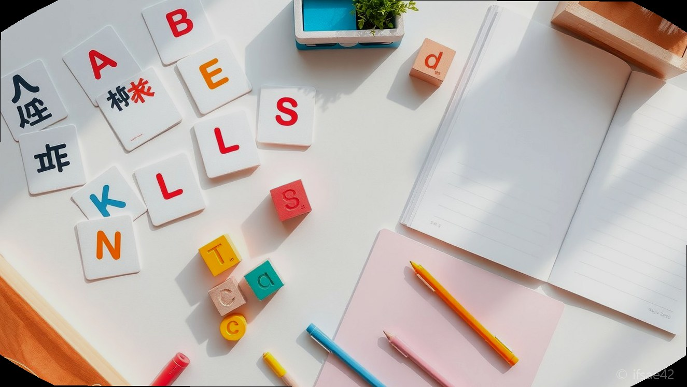
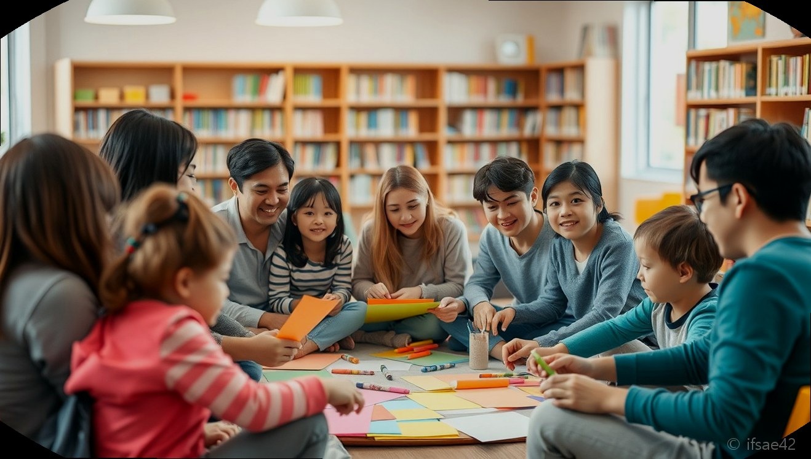

> 자동 생성 초안 · 2026-06-28

# 유아 한글 학습지 추천: 한글아이웃과 함께하는 엄마표 한글 공부 성공 가이드

아이의 성장에 맞춰 한글 교육을 고민하시는 부모님들이 많습니다. 처음 글자를 접하는 아이에게 한글은 단순한 문자가 아니라 세상을 배우는 첫 번째 언어이기에, 어떤 교재와 방법으로 시작해야 할지 막막함을 느끼는 것이 당연합니다. 특히 최근에는 단순히 글자를 암기하는 방식을 넘어, 아이가 즐겁게 학습할 수 있는 환경을 조성하는 것이 무엇보다 중요해졌습니다.

많은 학부모님이 학습지 선택에 어려움을 겪는 이유는 시중에 너무나 많은 교재가 존재하기 때문입니다. 하지만 아이의 발달 단계에 맞는 교재를 선택하고, 지역사회나 이웃과 함께하는 커뮤니티 활동을 병행한다면 한글 공부는 더 이상 고된 숙제가 아닌 즐거운 놀이가 될 수 있습니다. 오늘은 엄마표 한글 공부의 든든한 길잡이가 되어줄 ‘한글아이웃’의 가치와 효과적인 학습 전략을 정리해 드립니다.

## 유아 한글 교육의 시작, 단계별 학습지 선택 가이드

한글 교육의 시작은 아이가 글자에 관심을 보이기 시작하는 시점입니다. 이때 가장 중요한 것은 아이가 글자를 ‘공부’가 아닌 ‘놀이’로 받아들이게 하는 것입니다. 최근 학부모들 사이에서 높은 평가를 받는 길벗스쿨의 슈퍼 파닉스 한글 시리즈는 소리를 통해 원리를 익히는 방식으로, 아이들이 한글의 구조를 자연스럽게 이해하도록 돕습니다.

학습지를 선택할 때는 먼저 아이의 인지 발달 수준을 고려해야 합니다. 통글자 학습이 적합한지, 혹은 자음과 모음의 결합 원리를 파악하는 파닉스 방식이 필요한지 관찰해 보시기 바랍니다. 또한, 디자인적인 요소도 무시할 수 없습니다. 따뜻하고 조화로운 느낌을 주는 브랜딩이 적용된 교재는 아이에게 정서적 안정감을 주며 학습 몰입도를 높여줍니다. 마치 좋은 이웃이 브랜딩을 통해 친근함을 전달하듯, 아이의 눈높이에 맞춘 시각적 구성이 돋보이는 교재를 선택하는 것이 좋습니다.

## 이웃과 함께 만드는 즐거운 한글 공부 커뮤니티

한글 공부를 혼자서만 고민하지 마세요. 최근에는 지역 사회 내에서 ‘한글아이웃’과 같이 이웃과 함께하는 학습 모임이 큰 호응을 얻고 있습니다. ‘모든예술31’과 같은 프로젝트처럼 이웃들이 모여 직접 한글 그림책을 만들거나, 지우개 스탬프를 활용해 나만의 한글 교구를 제작하는 과정은 아이에게 잊지 못할 추억과 학습 동기를 부여합니다.

주민 밀착형 활동은 아이에게 한글이 우리 일상 속에 살아 숨 쉬는 소통의 도구임을 깨닫게 해줍니다. 이웃과 함께하는 학습은 혼자 하는 공부보다 지속 가능성이 높으며, 서로의 학습 노하우를 공유하면서 부모님 또한 교육적 스트레스를 줄일 수 있는 장점이 있습니다. 지역 커뮤니티를 통해 정보를 나누고, 함께 성장하는 환경을 만드는 것이야말로 엄마표 한글 공부를 성공으로 이끄는 핵심 비결입니다.

## 한글 학습 성공을 위한 체크리스트

- [ ] 아이가 글자에 호기심을 보이는 시기를 정확히 포착했는가?
- [ ] 아이의 기질에 맞는 학습 방식(놀이형, 반복형, 시각형)을 선택했는가?
- [ ] 하루 15분 내외의 짧고 굵은 학습 시간을 정해 규칙적으로 실천하는가?
- [ ] 단순히 글자 쓰기에 매몰되지 않고 소리 내어 읽는 파닉스 원리를 병행하는가?
- [ ] 지역 커뮤니티나 이웃과 함께하는 학습 활동을 통해 사회적 재미를 더했는가?
- [ ] 아이의 작은 성취에도 충분한 칭찬과 격려를 해주고 있는가?

## 자주 묻는 질문(FAQ)

**Q1. 한글 공부는 몇 살부터 시작하는 것이 가장 적절한가요?**
A1. 아이마다 개인차가 크지만, 보통 주변 글자에 관심을 보이고 자신의 이름을 읽고 싶어 하는 5세 전후가 가장 적절한 시기입니다.

**Q2. 한글 파닉스 교육이 왜 중요한가요?**
A2. 소리와 글자의 관계를 이해하는 파닉스 방식은 아이가 모르는 단어를 만났을 때 스스로 읽어낼 수 있는 응용력을 길러주기 때문입니다.

**Q3. 학습지 외에 집에서 할 수 있는 효과적인 놀이는 무엇인가요?**
A3. 이웃과 함께하는 그림책 만들기나 주변 사물에 이름표 붙이기 등 일상 속에서 한글을 자연스럽게 노출하는 놀이가 큰 도움이 됩니다.

오늘 소개해 드린 정보가 우리 아이의 첫 한글 공부를 시작하는 데 작은 보탬이 되었기를 바랍니다. 한글 공부는 속도보다 방향이 중요하며, 아이와 함께하는 즐거운 과정 자체가 가장 큰 교육입니다. 여러분은 아이와 어떤 방식으로 한글 공부를 즐기고 계신가요? 여러분만의 특별한 학습 노하우나 고민이 있다면 댓글로 자유롭게 공유해 주세요!

#한글아이웃 #유아한글공부 #엄마표한글학습
