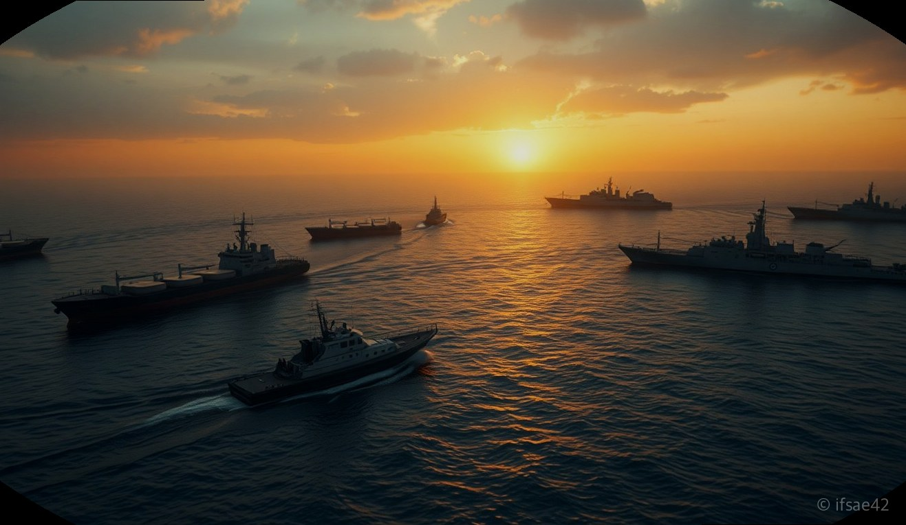
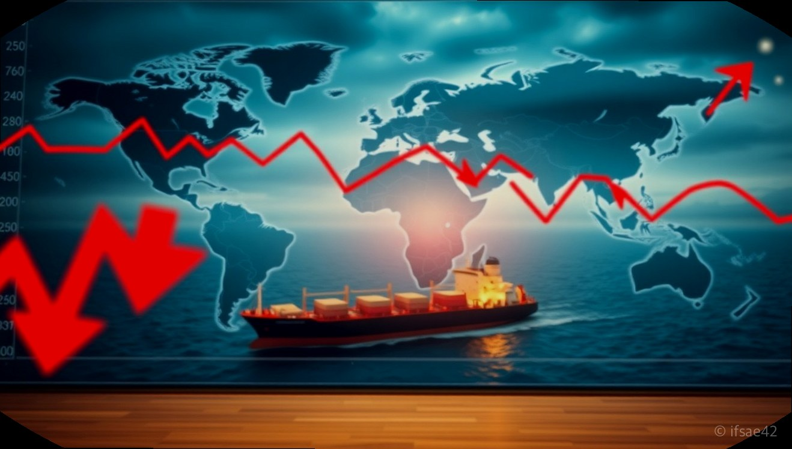

> 자동 생성 초안 · 2026-06-01

# 호르무즈 해협 봉쇄가 한국 경제와 주식 시장에 미치는 영향 총정리

최근 중동 지역의 지정학적 리스크가 고조되면서 세계 경제의 혈관이라 불리는 '호르무즈 해협'에 대한 관심이 그 어느 때보다 뜨겁습니다. 이란의 해협 봉쇄 위협과 그에 따른 국제 사회의 긴장감은 단순히 중동만의 문제가 아니라, 에너지 수입 의존도가 높은 대한민국 경제에 직접적인 타격을 줄 수 있는 중대한 사안입니다.

호르무즈 해협은 전 세계 원유 수송량의 약 30%가 통과하는 핵심 요충지입니다. 이곳이 막힌다는 것은 곧 글로벌 공급망의 마비와 유가 급등을 의미하며, 이는 우리 경제의 기초 체력을 흔들 수 있는 잠재적 위협이 됩니다. 오늘은 호르무즈 해협의 지정학적 의미와 이것이 한국 경제 및 주식 시장에 미치는 영향을 객관적으로 분석해 보겠습니다.

## 호르무즈 해협의 지정학적 가치와 국제법적 지위

호르무즈 해협은 이란과 오만 사이에 위치한 좁은 수로로, 페르시아만과 오만만을 잇는 유일한 해상 통로입니다. 이곳은 '세계의 석유 밸브'라고 불릴 만큼 에너지 안보에 있어 대체 불가능한 위치를 차지하고 있습니다.

국제법적으로 호르무즈 해협은 '국제 항행 해협'으로 분류됩니다. 유엔 해양법 협약(UNCLOS)에 따르면, 모든 선박은 연안국의 주권과 상관없이 '무해통항권(Innocent Passage)'을 보장받습니다. 즉, 이란이 자국 영해라는 이유로 통행을 제한하거나 강제로 통행료를 징수하는 것은 명백한 국제법 위반 행위입니다. 하지만 이란은 군사적 우위를 앞세워 해협 내 선박 나포나 군사 훈련을 통해 사실상의 봉쇄 조치를 취하며 국제사회를 압박하고 있습니다. 이는 단순한 영토 분쟁을 넘어 글로벌 에너지 공급망을 인질로 삼는 행위로 간주되어 미국을 비롯한 서방 국가들과 극심한 갈등을 빚고 있습니다.

## 해협 봉쇄가 유가 및 국내 주식 시장에 미치는 파급력

호르무즈 해협이 실제로 봉쇄되거나 통행이 제한될 경우, 가장 즉각적인 반응은 국제 유가의 급등입니다. 원유 공급 경로가 차단되면 수급 불균형이 발생하고, 이는 곧 국내 물가 상승(인플레이션)과 기업의 생산 비용 증가로 이어집니다.

투자자들 사이에서는 이러한 상황이 해운주와 에너지 관련주에 어떤 영향을 미칠지 관심이 집중됩니다. 일반적으로 해운업체(HMM, 팬오션, 대한해운 등)는 운임 상승에 대한 기대감으로 주가가 일시적으로 오를 수 있습니다. 물류 대란이 발생하면 선박 부족 현상이 심화되어 운임 지수가 상승하기 때문입니다. 하지만 장기적으로는 글로벌 교역량 자체가 감소하여 해운업 전반에 악재로 작용할 가능성도 배제할 수 없습니다.

또한, 에너지 수입 비중이 높은 한국 경제 특성상 유가 급등은 기업들의 영업이익을 갉아먹고 증시 전반의 투자 심리를 위축시킵니다. 따라서 단순히 특정 테마주에 편승하기보다는, 유가 변동이 국내 산업 전반에 미치는 비용 부담을 면밀히 분석하는 신중한 접근이 필요합니다.

## 대한민국 안보 현황과 정부의 대응 방향

대한민국 정부와 정치권에서도 호르무즈 해협의 긴장 상황을 매우 엄중하게 인식하고 있습니다. 최근 국방위원회 등에서는 우리 국적 선박이 공격받거나 나포되는 상황에 대비한 안보 태세를 점검하고 있습니다. 특히 에너지 수급의 70% 이상을 중동 지역에 의존하는 한국으로서는 해협의 안전한 통행이 국가 생존과 직결되는 문제이기 때문입니다.

정부는 국제 사회와 공조하여 해협의 안전을 확보하기 위한 외교적 노력을 기울이는 한편, 만약의 사태에 대비한 에너지 비축량 점검 및 수입선 다변화 전략을 추진하고 있습니다. 군사적으로는 우리 청해부대의 활동 범위를 고려한 대응책을 마련하는 등, 안보와 경제라는 두 마리 토끼를 잡기 위한 다각적인 대응 체계를 구축하고 있습니다.

---

### 투자자 및 경제 주체를 위한 체크리스트

- [ ] **에너지 수입 의존도 확인:** 현재 보유한 종목이나 기업이 중동발 유가 급등에 얼마나 취약한 구조인가?
- [ ] **운임 지수(BDI 등) 추이:** 해운주 투자 시, 일시적 급등인지 지속 가능한 운임 상승인지 확인했는가?
- [ ] **국제 정세 뉴스 모니터링:** 이란과 미국 간의 직접적인 충돌 여부 및 국제 사회의 제재 강도를 실시간으로 파악하고 있는가?
- [ ] **비상 대응 계획:** 유가 급등으로 인한 인플레이션 상황에서 자산 가치를 방어할 포트폴리오 전략이 마련되었는가?

### FAQ: 자주 묻는 질문

**Q1. 호르무즈 해협이 봉쇄되면 국내 주식 시장은 무조건 폭락하나요?**
A1. 반드시 그렇지는 않습니다. 지정학적 리스크는 단기적 충격을 주지만, 시장은 곧 새로운 상황에 적응합니다. 다만, 유가 급등은 기업의 비용 부담을 높여 증시 전체에 하방 압력을 가할 수 있습니다.

**Q2. 해운주가 전쟁 수혜주로 불리는 이유는 무엇인가요?**
A2. 해협 봉쇄로 물류 경로가 길어지거나 선박 공급이 부족해지면 운임이 상승하기 때문입니다. 하지만 이는 전쟁의 장기화 여부와 글로벌 경기 침체 가능성에 따라 변동성이 매우 큽니다.

**Q3. 정부는 호르무즈 해협 문제에 어떻게 대응하고 있나요?**
A3. 정부는 외교적 협력을 통해 해협의 자유로운 통항을 지지하며, 에너지 안보를 위해 원유 수입처 다변화와 비축유 방출 등 다양한 시나리오별 대응책을 마련하고 있습니다.

---

호르무즈 해협의 긴장은 우리 경제에 있어 결코 가볍게 볼 수 없는 변수입니다. 투자자라면 감정적인 대응보다는 객관적인 데이터와 글로벌 정세 변화를 면밀히 살피며, 리스크 관리에 집중하는 지혜가 필요합니다. 

#호르무즈해협 #국제유가 #경제전망
