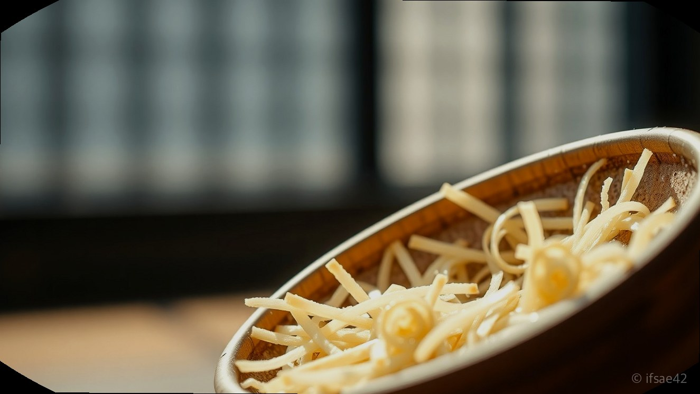

> 자동 생성 초안 · 2026-06-09

# 호카 오라 리커버리 뮬 사이즈 팁 및 3개월 실사용 솔직 후기, 착화감과 단점 정리

운동을 즐기거나 평소 발의 피로도가 높은 분들이라면 한 번쯤 들어보셨을 제품이 바로 호카오라리커버리뮬입니다. 처음에는 독특한 디자인 때문에 패션 아이템으로 주목받았지만, 신어본 사람들은 그 압도적인 편안함 때문에 일상화로 정착하는 경우가 많습니다. 저 역시 3개월 동안 매일같이 이 신발을 신으며 경험했던 장단점과 구매 전 꼭 알아두어야 할 사이즈 팁을 상세히 정리해 드립니다.

호카 오라 리커버리 뮬은 단순한 슬리퍼가 아니라 발의 회복을 돕기 위해 설계된 기능성 신발입니다. 특히 운동 후 지친 발을 감싸주는 쿠셔닝은 타 브랜드의 슬리퍼와는 차원이 다른 경험을 선사합니다. 구매를 망설이고 계신 분들을 위해 실제 착용감부터 사이즈 선택 가이드까지 가감 없이 공유하겠습니다.

## 실제 착화감과 쿠셔닝 성능 분석

호카 오라 리커버리 뮬의 가장 큰 특징은 바로 '분리형 깔창' 구조입니다. 일반적인 일체형 슬리퍼와 달리 깔창이 별도로 분리되는 설계 덕분에 세척이 용이하고, 발바닥의 아치를 탄탄하게 받쳐주는 느낌이 매우 강합니다. 처음 신었을 때의 느낌은 마치 구름 위를 걷는 듯한 푹신함보다는, 발을 전체적으로 안정감 있게 잡아주는 지지력에 가깝습니다.

장시간 착용했을 때의 피로도 감소 효과는 확실합니다. 저는 평소 발바닥 근막염으로 고생하는 편인데, 퇴근 후 이 신발을 신으면 발바닥에 가해지는 압력이 분산되는 것이 체감됩니다. 특히 임산부들이나 서서 일하는 시간이 긴 직업군에게 강력히 추천하는 이유이기도 합니다. 다만, 쿠션이 워낙 두껍다 보니 처음에는 지면과의 높이감 때문에 약간의 어색함이 있을 수 있으나, 며칠만 지나면 금세 적응됩니다.

## 사이즈 선택 팁과 발볼 및 발등 정보

많은 분이 가장 고민하시는 부분이 바로 사이즈입니다. 호카 오라 리커버리 뮬은 기본적으로 발볼이 넉넉하게 나온 편은 아닙니다. 저는 평소 운동화 240mm를 신는데, 이 제품은 250mm(10단위)를 선택했습니다. 결론부터 말씀드리면, 양말을 신고 착용하는 경우가 많다면 무조건 '반업' 또는 '10단위 업'을 추천합니다.

발등이 높거나 발볼이 넓은 분들은 정사이즈를 선택할 경우 발등 부분이 상당히 타이트하게 느껴질 수 있습니다. 뮬 형태라 뒤축이 없어서 헐떡거릴까 봐 걱정되시겠지만, 발등을 덮는 어퍼 부분이 꽤 단단하게 잡아주기 때문에 사이즈를 여유 있게 가셔도 보행에 큰 지장은 없습니다. 245mm를 신으시는 분들이라면 250mm를 선택하는 것이 가장 실패 없는 방법입니다.

## 색상별 특징과 코디 활용법 및 단점

호카 오라 리커버리 뮬은 블랙, 바닐라, 그리고 시즌별로 출시되는 오묘한 색감들로 인기가 많습니다. 가장 무난한 블랙은 어떤 옷차림에도 잘 어울리며 오염 관리가 쉽다는 장점이 있고, 바닐라 컬러는 화사한 느낌을 주어 여름철 반바지나 가을철 조거 팬츠와 매치했을 때 포인트가 됩니다. 다만, 밝은 색상은 오염에 취약할 수 있으니 관리에 유의해야 합니다.

물론 단점도 존재합니다. 첫째, 비 오는 날에는 소재 특성상 미끄러울 수 있습니다. 바닥 접지력이 아주 뛰어난 편은 아니므로 빗길에서는 주의가 필요합니다. 둘째, 소재가 다소 단단한 EVA 소재라 초기에는 발등 피부가 예민하신 분들에게는 쓸림 현상이 발생할 수 있습니다. 저는 초반 1주일은 양말을 착용하여 길들이는 과정을 거쳤더니 훨씬 편안해졌습니다.

## 체크리스트: 구매 전 확인하세요

- [ ] 평소 운동화 사이즈보다 5~10mm 크게 선택했는가?
- [ ] 양말을 신고 착용할 계획인가? (그렇다면 10mm 업 권장)
- [ ] 발등이 높은 편인가? (그렇다면 무조건 사이즈 업)
- [ ] 공식 홈페이지나 신뢰할 수 있는 편집숍의 재고를 확인했는가?
- [ ] 가품 주의: 너무 저렴한 가격의 사이트는 피하고 정식 유통 경로를 이용했는가?

## FAQ

**Q1. 호카 오라 리커버리 뮬 사이즈 선택 시 팁이 무엇인가요?**
A1. 발등이 높거나 발볼이 있다면 무조건 10단위 업을 권장하며 양말 착용을 고려해 여유 있게 구매하는 것이 좋습니다.

**Q2. 임산부나 운동 후 착용하기에 정말 편안한가요?**
A2. 아치를 지지해주는 설계와 뛰어난 쿠셔닝 덕분에 발의 피로를 풀어주는 데 매우 효과적이라 추천합니다.

**Q3. 세탁은 어떻게 하는 것이 가장 좋은가요?**
A3. 깔창이 분리되는 구조이므로 깔창은 따로 빼서 중성세제로 세척하고 본체는 물티슈나 가벼운 물세척 후 그늘에서 말리면 됩니다.

**Q4. 비 오는 날 미끄러움은 어떤가요?**
A4. 밑창의 접지력이 일반 운동화보다 낮을 수 있어 빗길에서는 주의해서 걷는 것이 좋습니다.

마지막으로 호카 오라 리커버리 뮬은 정가 대비 만족도가 매우 높은 신발입니다. 품절이 잦은 모델인 만큼 공홈 재입고 알림을 활용하시거나 신뢰할 수 있는 대형 온라인 몰의 재고를 수시로 체크하시길 바랍니다. 한 번 신으면 다른 슬리퍼로 돌아가기 어려울 만큼 편안한 착화감을 직접 경험해 보시길 권장합니다.

#호카오라리커버리뮬 #호카슬리퍼 #편한신발추천
