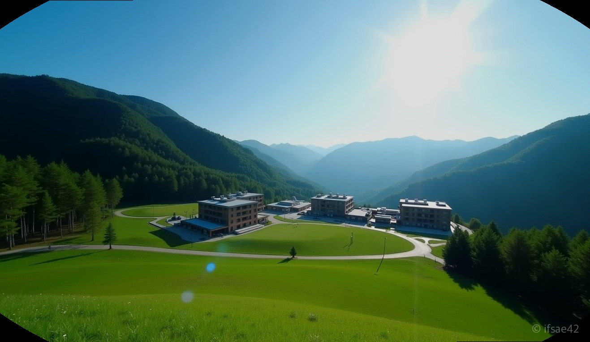
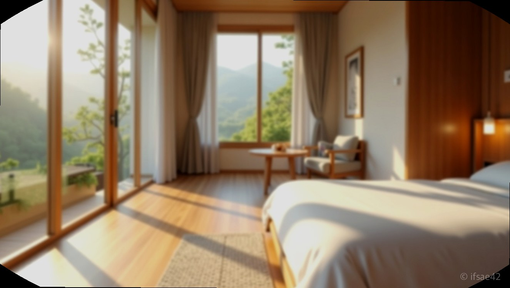
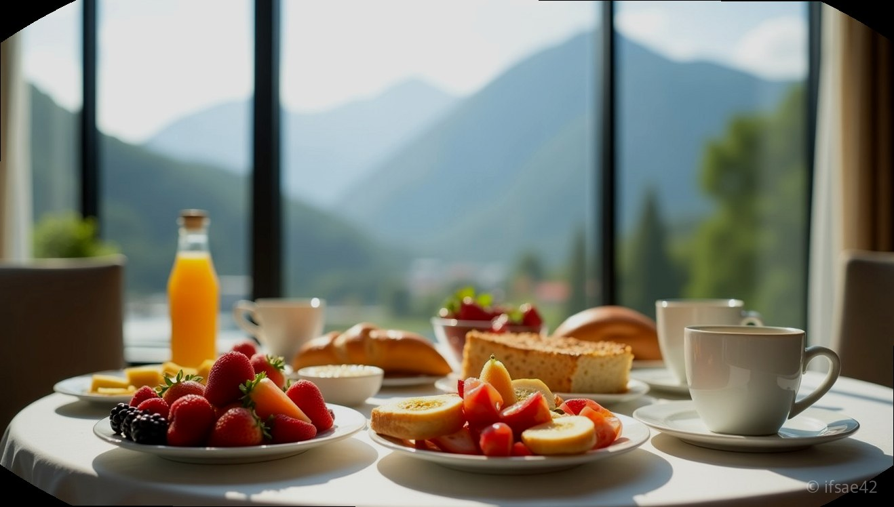

> 자동 생성 초안 · 2026-07-14

# 휘닉스 리조트 평창 아기랑 숙박 후기: 조식, 워터파크 꿀팁 총정리

아이와 함께하는 여행은 짐을 싸는 순간부터 고민의 연속입니다. 젖병 소독기부터 비상약까지 챙기다 보면 어느덧 캐리어는 터질 듯하고, 숙소에 도착해서도 이동 동선이 길면 금세 지치기 마련이죠. 이런 고민을 한 번에 해결해 주는 곳이 바로 **휘닉스리조트평창**입니다. 리조트 단지 내에서 숙박, 식사, 물놀이, 산책까지 모든 것을 해결할 수 있어 '올인원' 가족 여행지로 제격입니다. 직접 다녀온 경험을 바탕으로 아기랑 방문 시 꼭 알아두어야 할 꿀팁을 정리해 드립니다.

## 객실 선택과 숙박 팁
아이와 함께라면 객실 선택이 여행의 질을 좌우합니다. 휘닉스리조트평창은 크게 호텔형과 콘도형으로 나뉘는데, 아기와 함께라면 취사가 가능하고 공간이 분리된 콘도형을 추천합니다. 스탠다드 객실은 깔끔하고 효율적인 구조라 3~4인 가족이 머물기에 부족함이 없습니다. 만약 조금 더 여유로운 휴식을 원하신다면 스위트 객실을 선택해 거실 공간을 확보하는 것도 좋은 방법입니다.

객실 예약 시에는 ‘키즈룸’ 패키지를 눈여겨보세요. 아이들이 좋아하는 캐릭터 테마나 안전 가드가 설치된 객실은 부모님의 걱정을 덜어줍니다. 팁을 하나 드리자면, 예약 사이트의 할인 쿠폰이나 숙박 세일 페스타 기간을 활용하면 훨씬 합리적인 가격으로 패키지를 구성할 수 있습니다. 체크인 시에는 아이의 낮잠 시간을 고려해 가급적 일찍 도착해 대기 번호를 받는 것이 정신 건강에 좋습니다.

## 온도 레스토랑 조식 이용법
리조트의 꽃이라 할 수 있는 '온도' 레스토랑 조식은 종류가 다양하고 퀄리티가 높아 투숙객 만족도가 높습니다. 아이를 동반한 가족 단위 이용객이 많다 보니 유아용 식기와 아기 의자가 충분히 비치되어 있는 점이 큰 장점입니다.

조식 꿀팁을 드리자면, 8시 이후부터는 웨이팅이 발생할 수 있습니다. 아이와 함께라면 조금 서둘러 7시 30분 이전에 입장하는 것을 추천합니다. 메뉴 중에서는 속이 편한 전복죽이나 볶음밥 종류가 아이 식사로 좋고, 신선한 과일과 베이커리 코너도 충실합니다. 특히 창가 자리에 앉으면 평창의 아름다운 산 풍경을 보며 여유롭게 식사할 수 있으니 참고하시기 바랍니다.

## 블루캐니언 워터파크 가이드
휘닉스리조트평창의 자랑인 블루캐니언은 실내외가 잘 구성되어 있어 사계절 내내 물놀이가 가능합니다. 어린아이와 방문했다면 실내 유아풀을 적극 활용하세요. 수온이 적당하고 수심이 낮아 돌쟁이 아기도 안전하게 물놀이를 즐길 수 있습니다.

수영장 내에서는 튜브 바람을 넣는 곳이 따로 있지만, 주말에는 붐빌 수 있으니 미리 준비하는 것이 좋습니다. 또한 수영장 입구에서 판매하는 방수 기저귀를 잊지 마세요. 물놀이 후에는 리조트 내 '상상놀이터'와 같은 키즈 카페 시설을 이용하면 아이들의 에너지를 끝까지 발산시키기에 안성맞춤입니다.

## 리조트 내 힐링 액티비티
리조트 밖으로 나갈 필요 없이 단지 내 산책로만 걸어도 충분합니다. 곤돌라를 타고 정상에 올라가면 탁 트인 평창의 전경을 감상할 수 있는데, 아이와 함께 유모차를 끌고 천천히 걷기에도 길 정비가 잘 되어 있습니다. 맑은 공기를 마시며 숲길을 걷다 보면 일상에서 쌓인 피로가 자연스럽게 풀리는 기분이 듭니다.

**Q1. 아기랑 방문 시 이유식 데우기는 어떻게 하나요?**
A1. 객실 내 전자레인지가 구비된 경우가 많지만, 없는 객실이라면 프런트에 문의하거나 콘도 내 공용 전자레인지를 이용할 수 있습니다.

여행을 준비하는 과정에서 동선이 짧은 곳을 선택하는 것만으로도 아이와 부모 모두 훨씬 즐거운 시간을 보낼 수 있습니다. 이번 주말, 고민 없이 떠날 수 있는 평창으로의 가족 여행을 계획해 보시는 건 어떨까요?

#휘닉스리조트평창 #평창여행 #아기랑여행 #강원도호캉스 #블루캐니언
